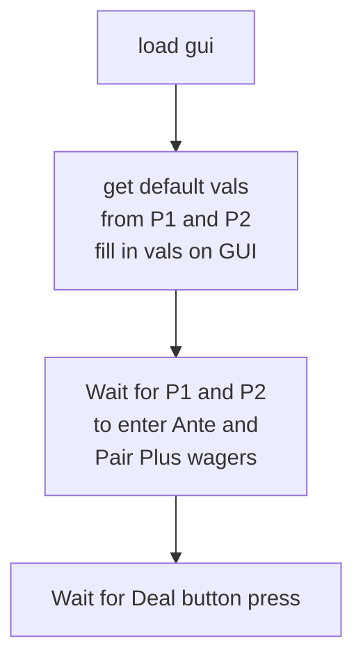

# cs342-poker

## Logic Flowchart

```mermaid
  graph TD;
      A[load gui ]-->B[get default vals <br> from P1 and P2 <br> fill in vals on GUI];
      B-->C[Wait for P1 and P2 <br> to enter Ante and <br> Pair Plus wagers];
      C-->D[Wait for Deal button press];
```
