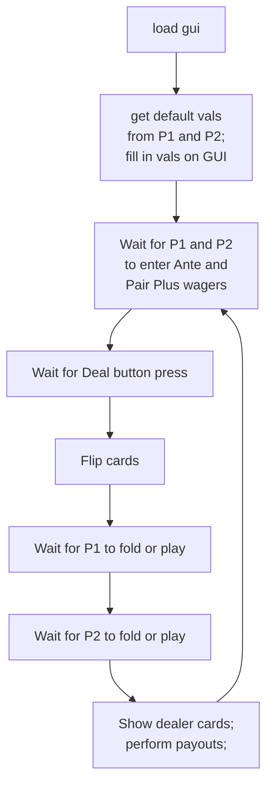

# cs342-poker

## Logic Flowchart

```mermaid
  graph TD;
      A[load gui ]-->B[get default vals <br> from P1 and P2; <br> fill in vals on GUI];
      B-->C[Wait for P1 and P2 <br> to enter Ante and <br> Pair Plus wagers];
      C-->D[Wait for Deal button press];
      D-->E[Flip cards];
      E-->F[Wait for P1 to fold or play];
      F-->G[Wait for P2 to fold or play];
      G-->H[Show dealer cards; <br> perform payouts;];
      H-->C;
```
